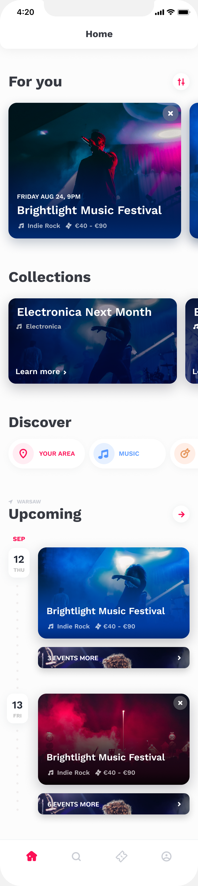

## freebie-ticket-expo

Home page from a figma project using expo and react-native.

---

**Figma project:** [Freebie-Ticket.fig](./Freebie-Ticket.fig)

**Page based:**

---

### Setup

**Install dependencies:**

yarn: `yarn` or `yarn install`
npm: `npm i` or `npm install`

**Run project:**

yarn: `yarn start`
npm: `npm start`
